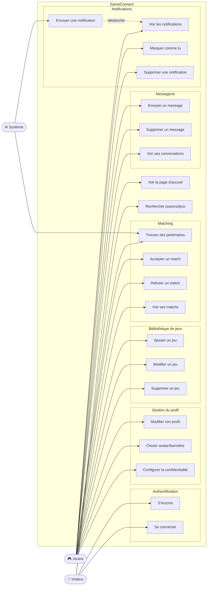

# Diagrammes des cas d'utilisation — GameConnect

## 1. Diagramme global

---

## 2. Description des cas d'utilisation principaux

### UC-01 : S'inscrire

| Champ | Valeur |
|---|---|
| **Acteur principal** | Visiteur |
| **Préconditions** | L'email et le pseudo ne sont pas déjà utilisés |
| **Scénario nominal** | 1. Le visiteur saisit email, pseudo, mot de passe (×2) ; 2. Il complète les infos optionnelles (région, bio, Discord) ; 3. Le système valide, crée le compte et retourne un token JWT ; 4. Le visiteur est redirigé vers l'accueil en tant que Joueur. |
| **Exceptions** | Email déjà utilisé → message d'erreur ; Mot de passe trop faible → message d'erreur ; Pseudo invalide → message d'erreur |
| **Post-conditions** | Compte créé, profil initialisé, token JWT en localStorage |
| **Endpoint** | `POST /register` |

---

### UC-02 : Se connecter

| Champ | Valeur |
|---|---|
| **Acteur principal** | Visiteur |
| **Préconditions** | Le compte existe |
| **Scénario nominal** | 1. Le visiteur saisit email et mot de passe ; 2. Le système vérifie le hash bcrypt ; 3. Un token JWT est émis et stocké ; 4. Redirection vers le tableau de bord. |
| **Exceptions** | Identifiants incorrects → message générique (pas de distinction email/mot de passe pour la sécurité) |
| **Post-conditions** | Token JWT valide 7 jours en localStorage |
| **Endpoint** | `POST /login` |

---

### UC-03 : Gérer ses jeux

| Champ | Valeur |
|---|---|
| **Acteur principal** | Joueur |
| **Préconditions** | Joueur connecté |
| **Scénario nominal — Ajout** | 1. Joueur choisit un jeu dans le catalogue ; 2. Il définit niveau, rang, heures jouées, favori ; 3. Le système enregistre et met à jour le profil. |
| **Scénario nominal — Modification** | 1. Joueur clique sur ✏️ d'un jeu existant ; 2. La modal s'ouvre avec les valeurs actuelles ; 3. Il modifie les champs souhaités ; 4. Le système met à jour via `PUT /user/games/{id}`. |
| **Scénario nominal — Suppression** | 1. Joueur clique sur l'icône de suppression ; 2. Le système supprime la ligne dans `user_games`. |
| **Exceptions** | Jeu déjà dans le profil → erreur 409 ; Jeu introuvable → erreur 404 |
| **Endpoints** | `GET /user/games`, `POST /user/games`, `PUT /user/games/{id}`, `DELETE /user/games/{id}` |

---

### UC-04 : Trouver des partenaires (Matching)

| Champ | Valeur |
|---|---|
| **Acteur principal** | Joueur + Système |
| **Préconditions** | Joueur connecté, au moins un jeu dans son profil |
| **Scénario nominal** | 1. Joueur clique sur "Trouver" ; 2. Le système calcule un score de compatibilité avec chaque autre joueur (jeux communs, niveaux, région, timezone, playstyle) ; 3. Les 10 meilleures propositions sont affichées triées par score ; 4. Le joueur accepte ou refuse chaque proposition. |
| **Règle métier** | Score max = 150 pts : jeux communs (30/jeu, max 60), niveau (30), région (15), timezone (10), playstyle (15) |
| **Exceptions** | Aucun joueur compatible → message informatif |
| **Endpoint** | `POST /matches?limit=10` |

---

### UC-05 : Envoyer et supprimer un message

| Champ | Valeur |
|---|---|
| **Acteur principal** | Joueur |
| **Préconditions** | Les deux joueurs ont un match avec status `accepted` |
| **Scénario nominal — Envoi** | 1. Joueur ouvre une conversation ; 2. Il saisit un message (max 1000 chars) ; 3. Le message apparaît immédiatement (optimistic update) ; 4. La confirmation serveur remplace le message temporaire. |
| **Scénario nominal — Suppression** | 1. Joueur survole son message → icône 🗑 apparaît ; 2. Clic → `DELETE /messages/{id}` ; 3. Le serveur met `deleted_at = NOW()` ; 4. Le message disparaît de l'interface, reste en base. |
| **Exceptions** | Joueurs sans match accepté → erreur 403 ; Message non trouvé → erreur 404 |
| **Endpoints** | `GET /messages`, `GET /messages/{userId}`, `POST /messages`, `DELETE /messages/{id}` |
