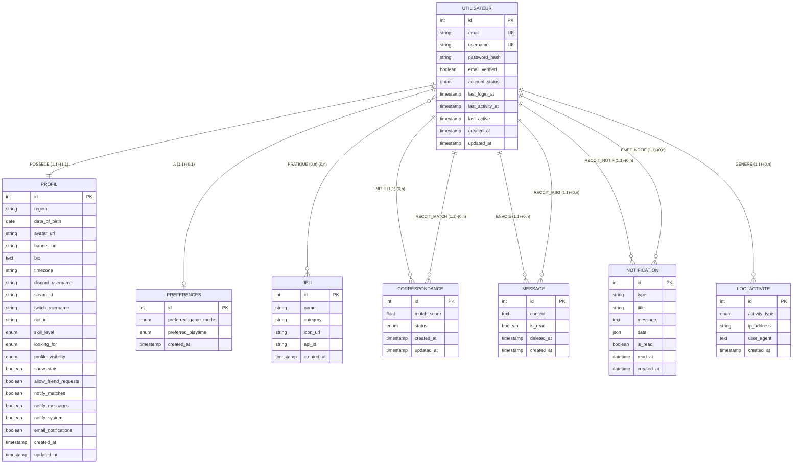

# Modèle Conceptuel de Données (MCD) — GameConnect
## Standard Merise 2

## 1. Diagramme entité-association

---

## 2. Entités et attributs (notation Merise 2)

### UTILISATEUR
**Identifiant** : `#id`

| Attribut | Type | Contrainte | Description |
|---|---|---|---|
| #id | Entier | PK, AUTO_INCREMENT | Identifiant unique |
| email | Chaîne(255) | UNIQUE, NOT NULL | Adresse email |
| username | Chaîne(50) | UNIQUE, NOT NULL | Pseudo (3-50 chars) |
| password_hash | Chaîne(255) | NOT NULL | Hash bcrypt |
| email_verified | Booléen | DEFAULT FALSE | Email vérifié |
| account_status | Énuméré | DEFAULT 'active' | active/inactive/suspended/deleted |
| last_login_at | Timestamp | NULL | Dernière connexion |
| last_activity_at | Timestamp | NULL | Dernière activité |
| last_active | Timestamp | DEFAULT NOW() | Indicateur d'activité récente |
| created_at | Timestamp | DEFAULT NOW() | Date de création |
| updated_at | Timestamp | ON UPDATE NOW() | Date de modification |

---

### PROFIL
**Identifiant** : `#id`  
**Dépendance** : 1-1 avec UTILISATEUR (extension du compte)

| Attribut | Type | Contrainte | Description |
|---|---|---|---|
| #id | Entier | PK | |
| region | Chaîne(255) | NULL | Zone géographique |
| date_of_birth | Date | NULL | Date de naissance (min 13 ans) |
| avatar_url | Chaîne(500) | NULL | URL de l'avatar |
| banner_url | Chaîne(500) | NULL | URL de la bannière |
| bio | Texte | NULL, max 1000 | Biographie |
| timezone | Chaîne(50) | NULL | Fuseau horaire |
| discord_username | Chaîne(100) | NULL | Identifiant Discord |
| steam_id | Chaîne(100) | NULL | Identifiant Steam |
| twitch_username | Chaîne(100) | NULL | Identifiant Twitch |
| riot_id | Chaîne(100) | NULL | Identifiant Riot (Valorant/LoL) |
| skill_level | Énuméré | DEFAULT 'beginner' | beginner/intermediate/advanced/expert |
| looking_for | Énuméré | DEFAULT 'teammates' | teammates/mentor/casual_friends/competitive_team |
| profile_visibility | Énuméré | DEFAULT 'public' | public/friends/private |
| show_stats | Booléen | DEFAULT TRUE | Afficher les stats |
| allow_friend_requests | Booléen | DEFAULT TRUE | Autoriser demandes d'amis |
| notify_matches | Booléen | DEFAULT TRUE | Notifications matchs |
| notify_messages | Booléen | DEFAULT TRUE | Notifications messages |
| notify_system | Booléen | DEFAULT TRUE | Notifications système |
| email_notifications | Booléen | DEFAULT FALSE | Notifications par email |

---

### JEU
**Identifiant** : `#id`

| Attribut | Type | Contrainte | Description |
|---|---|---|---|
| #id | Entier | PK | |
| name | Chaîne(255) | NOT NULL | Nom du jeu |
| category | Chaîne(100) | NULL | FPS, MOBA, Battle Royale… |
| icon_url | Chaîne(500) | NULL | URL de l'icône |
| api_id | Chaîne(100) | NULL | Identifiant API externe |

---

### PREFERENCES
**Identifiant** : `#id`  
**Cardinalité** : 0 ou 1 préférence par utilisateur

| Attribut | Type | Contrainte | Description |
|---|---|---|---|
| preferred_game_mode | Énuméré | DEFAULT 'any' | competitive/casual/any |
| preferred_playtime | Énuméré | DEFAULT 'any' | morning/afternoon/evening/night/any |

---

### CORRESPONDANCE *(entité-association)*
**Identifiant** : `#id`  
**Associe** : UTILISATEUR ×2 (user1 et user2)

| Attribut | Type | Contrainte | Description |
|---|---|---|---|
| match_score | Réel | DEFAULT 0 | Score 0-150 |
| status | Énuméré | DEFAULT 'pending' | pending/accepted/rejected/expired |

---

### MESSAGE
**Identifiant** : `#id`  
**Associe** : UTILISATEUR (expéditeur) × UTILISATEUR (destinataire)

| Attribut | Type | Contrainte | Description |
|---|---|---|---|
| content | Texte | NOT NULL | Contenu du message |
| is_read | Booléen | DEFAULT FALSE | Lu par le destinataire |
| **deleted_at** | Timestamp | NULL | **Soft-delete** : NULL = actif, non-NULL = supprimé |

---

### NOTIFICATION
**Identifiant** : `#id`

| Attribut | Type | Contrainte | Description |
|---|---|---|---|
| type | Chaîne(50) | DEFAULT 'system' | match_new/match_accepted/message_new/system… |
| title | Chaîne(255) | NOT NULL | Titre |
| message | Texte | NOT NULL | Corps de la notification |
| data | JSON | NULL | Données additionnelles |
| is_read | Booléen | DEFAULT FALSE | |
| read_at | DateTime | NULL | Date de lecture |

---

### LOG_ACTIVITE
**Identifiant** : `#id`

| Attribut | Type | Contrainte | Description |
|---|---|---|---|
| activity_type | Énuméré | NOT NULL | login/logout/profile_update/message_sent/match_action/game_added |
| ip_address | Chaîne(45) | NULL | Adresse IP |
| user_agent | Texte | NULL | Navigateur/OS |

---

## 3. Associations (notation Merise 2 : cardinalités)

| Association | Entité A | Card. A | Card. B | Entité B | Attributs portés |
|---|---|---|---|---|---|
| POSSEDE | UTILISATEUR | (1,1) | (1,1) | PROFIL | — |
| A | UTILISATEUR | (1,1) | (0,1) | PREFERENCES | — |
| PRATIQUE | UTILISATEUR | (0,n) | (0,n) | JEU | skill_level, game_rank, hours_played, is_favorite |
| INITIE | UTILISATEUR | (0,n) | — | CORRESPONDANCE | — |
| RECOIT_MATCH | UTILISATEUR | (0,n) | — | CORRESPONDANCE | — |
| ENVOIE | UTILISATEUR | (1,n) | (0,n) | MESSAGE | — |
| RECOIT_MSG | UTILISATEUR | (0,n) | (1,n) | MESSAGE | — |
| RECOIT_NOTIF | UTILISATEUR | (1,1) | (0,n) | NOTIFICATION | — |
| EMET_NOTIF | UTILISATEUR | (0,1) | (0,n) | NOTIFICATION | — |
| GENERE | UTILISATEUR | (1,1) | (0,n) | LOG_ACTIVITE | — |

> **Lecture des cardinalités Merise 2** : (min, max)  
> (0,n) = "zéro ou plusieurs"  
> (1,1) = "exactement un"  
> (0,1) = "zéro ou un"
