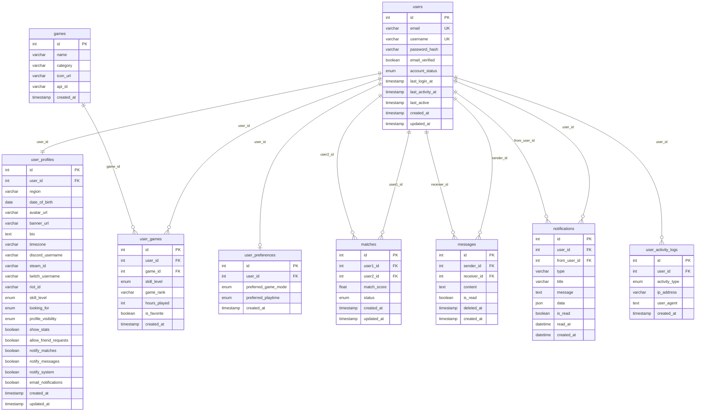

# Modèle Logique de Données (MLD) — GameConnect
## Dérivé du MCD Merise 2

## 1. Règles de passage MCD → MLD

| Règle | Application |
|---|---|
| Entité → Table | Chaque entité devient une table |
| Association (1,1)-(1,1) | Fusion ou clé étrangère dans l'une des tables |
| Association (1,n)-(0,n) | Clé étrangère du côté (1,n) |
| Association (0,n)-(0,n) | Table de jonction avec les deux FK |
| Entité-association | Table propre avec FK vers les entités associées + attributs propres |
| Attributs de l'association (0,n)-(0,n) | Colonnes dans la table de jonction |

---

## 2. Schéma relationnel



---

## 3. Tables détaillées

### `users`
```
users(
  #id            INT          NOT NULL AUTO_INCREMENT,
   email         VARCHAR(255) NOT NULL UNIQUE,
   username      VARCHAR(50)  NOT NULL UNIQUE,
   password_hash VARCHAR(255) NOT NULL,
   email_verified BOOLEAN     NOT NULL DEFAULT FALSE,
   account_status ENUM('active','inactive','suspended','deleted') DEFAULT 'active',
   last_login_at  TIMESTAMP   NULL,
   last_activity_at TIMESTAMP NULL,
   last_active    TIMESTAMP   NOT NULL DEFAULT CURRENT_TIMESTAMP,
   created_at     TIMESTAMP   NOT NULL DEFAULT CURRENT_TIMESTAMP,
   updated_at     TIMESTAMP   NOT NULL DEFAULT CURRENT_TIMESTAMP ON UPDATE CURRENT_TIMESTAMP
)
```

### `user_profiles`
```
user_profiles(
  #id                  INT          NOT NULL AUTO_INCREMENT,
   user_id             INT          NOT NULL UNIQUE,  ← FK → users(id) CASCADE
   region              VARCHAR(255) NULL,
   date_of_birth       DATE         NULL,
   avatar_url          VARCHAR(500) NULL,
   banner_url          VARCHAR(500) NULL,
   bio                 TEXT         NULL,
   timezone            VARCHAR(50)  NULL,
   discord_username    VARCHAR(100) NULL,
   steam_id            VARCHAR(100) NULL,
   twitch_username     VARCHAR(100) NULL,
   riot_id             VARCHAR(100) NULL,
   skill_level         ENUM('beginner','intermediate','advanced','expert') DEFAULT 'beginner',
   looking_for         ENUM('teammates','mentor','casual_friends','competitive_team') DEFAULT 'teammates',
   profile_visibility  ENUM('public','friends','private') DEFAULT 'public',
   show_stats          BOOLEAN NOT NULL DEFAULT TRUE,
   allow_friend_requests BOOLEAN NOT NULL DEFAULT TRUE,
   notify_matches      BOOLEAN NOT NULL DEFAULT TRUE,
   notify_messages     BOOLEAN NOT NULL DEFAULT TRUE,
   notify_system       BOOLEAN NOT NULL DEFAULT TRUE,
   email_notifications BOOLEAN NOT NULL DEFAULT FALSE,
   created_at          TIMESTAMP NOT NULL DEFAULT CURRENT_TIMESTAMP,
   updated_at          TIMESTAMP NOT NULL DEFAULT CURRENT_TIMESTAMP ON UPDATE CURRENT_TIMESTAMP
)
```

### `games`
```
games(
  #id        INT          NOT NULL AUTO_INCREMENT,
   name      VARCHAR(255) NOT NULL,
   category  VARCHAR(100) NULL,
   icon_url  VARCHAR(500) NULL,
   api_id    VARCHAR(100) NULL,
   created_at TIMESTAMP   NOT NULL DEFAULT CURRENT_TIMESTAMP
)
```

### `user_games` *(table de jonction PRATIQUE)*
```
user_games(
  #id           INT  NOT NULL AUTO_INCREMENT,
   user_id      INT  NOT NULL,  ← FK → users(id) CASCADE
   game_id      INT  NOT NULL,  ← FK → games(id) CASCADE
   skill_level  ENUM('beginner','intermediate','advanced','expert') DEFAULT 'beginner',
   game_rank    VARCHAR(100) NULL,
   hours_played INT  NOT NULL DEFAULT 0,
   is_favorite  BOOLEAN NOT NULL DEFAULT FALSE,
   created_at   TIMESTAMP NOT NULL DEFAULT CURRENT_TIMESTAMP,
   UNIQUE(user_id, game_id)
)
```

### `user_preferences`
```
user_preferences(
  #id                  INT NOT NULL AUTO_INCREMENT,
   user_id             INT NOT NULL,  ← FK → users(id) CASCADE
   preferred_game_mode ENUM('competitive','casual','any') DEFAULT 'any',
   preferred_playtime  ENUM('morning','afternoon','evening','night','any') DEFAULT 'any',
   created_at          TIMESTAMP NOT NULL DEFAULT CURRENT_TIMESTAMP
)
```

### `matches` *(entité-association CORRESPONDANCE)*
```
matches(
  #id          INT   NOT NULL AUTO_INCREMENT,
   user1_id    INT   NOT NULL,  ← FK → users(id) CASCADE
   user2_id    INT   NOT NULL,  ← FK → users(id) CASCADE
   match_score FLOAT NOT NULL DEFAULT 0,
   status      ENUM('pending','accepted','rejected','expired') DEFAULT 'pending',
   created_at  TIMESTAMP NOT NULL DEFAULT CURRENT_TIMESTAMP,
   updated_at  TIMESTAMP NOT NULL DEFAULT CURRENT_TIMESTAMP ON UPDATE CURRENT_TIMESTAMP,
   UNIQUE(user1_id, user2_id)
)
```

### `messages`
```
messages(
  #id          INT  NOT NULL AUTO_INCREMENT,
   sender_id   INT  NOT NULL,  ← FK → users(id) CASCADE
   receiver_id INT  NOT NULL,  ← FK → users(id) CASCADE
   content     TEXT NOT NULL,
   is_read     BOOLEAN   NOT NULL DEFAULT FALSE,
   deleted_at  TIMESTAMP NULL DEFAULT NULL,        ← Soft-delete
   created_at  TIMESTAMP NOT NULL DEFAULT CURRENT_TIMESTAMP
)
```

### `notifications`
```
notifications(
  #id           INT          NOT NULL AUTO_INCREMENT,
   user_id      INT          NOT NULL,  ← FK → users(id) CASCADE
   from_user_id INT          NULL,      ← FK → users(id) SET NULL
   type         VARCHAR(50)  NOT NULL DEFAULT 'system',
   title        VARCHAR(255) NOT NULL,
   message      TEXT         NOT NULL,
   data         JSON         NULL,
   is_read      BOOLEAN      NOT NULL DEFAULT FALSE,
   read_at      DATETIME     NULL,
   created_at   DATETIME     NOT NULL DEFAULT CURRENT_TIMESTAMP
)
```

### `user_activity_logs`
```
user_activity_logs(
  #id            INT NOT NULL AUTO_INCREMENT,
   user_id       INT NOT NULL,  ← FK → users(id) CASCADE
   activity_type ENUM('login','logout','profile_update','message_sent','match_action','game_added') NOT NULL,
   ip_address    VARCHAR(45) NULL,
   user_agent    TEXT        NULL,
   created_at    TIMESTAMP   NOT NULL DEFAULT CURRENT_TIMESTAMP
)
```

---

## 4. Index

| Table | Index | Colonnes | Type |
|---|---|---|---|
| users | PK | id | PRIMARY |
| users | uq_email | email | UNIQUE |
| users | uq_username | username | UNIQUE |
| users | idx_last_activity | last_activity_at | INDEX |
| users | idx_account_status | account_status | INDEX |
| user_profiles | uq_user_profile | user_id | UNIQUE |
| user_profiles | idx_region | region | INDEX |
| user_profiles | idx_profiles_visibility | profile_visibility | INDEX |
| games | idx_games_category | category | INDEX |
| games | idx_games_name | name | INDEX |
| user_games | uq_user_game | (user_id, game_id) | UNIQUE |
| user_games | idx_ug_user_id | user_id | INDEX |
| user_games | idx_ug_game_id | game_id | INDEX |
| matches | uq_match | (user1_id, user2_id) | UNIQUE |
| matches | idx_matches_user1_status | (user1_id, status) | INDEX |
| matches | idx_matches_user2_status | (user2_id, status) | INDEX |
| matches | idx_matches_created_at | created_at | INDEX |
| messages | idx_messages_conversation | (sender_id, receiver_id, created_at) | INDEX |
| messages | idx_messages_unread | (receiver_id, is_read) | INDEX |
| messages | idx_messages_deleted_at | deleted_at | INDEX |
| notifications | idx_notifications_unread | (user_id, is_read) | INDEX |
| user_activity_logs | idx_user_activity | (user_id, created_at) | INDEX |
