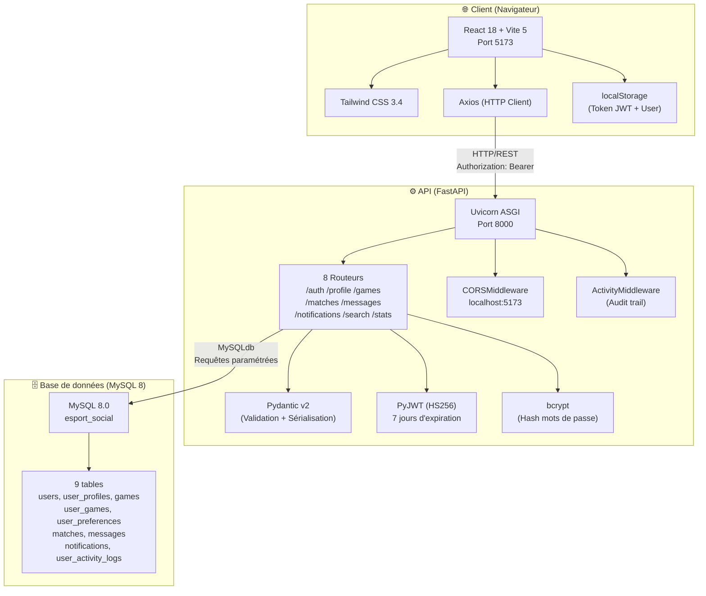
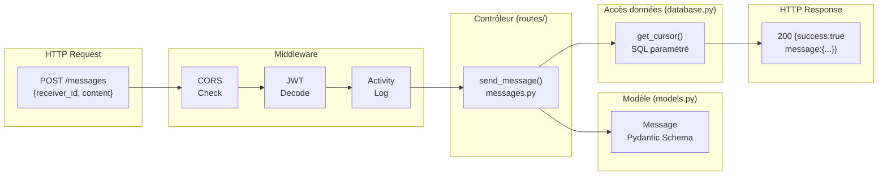
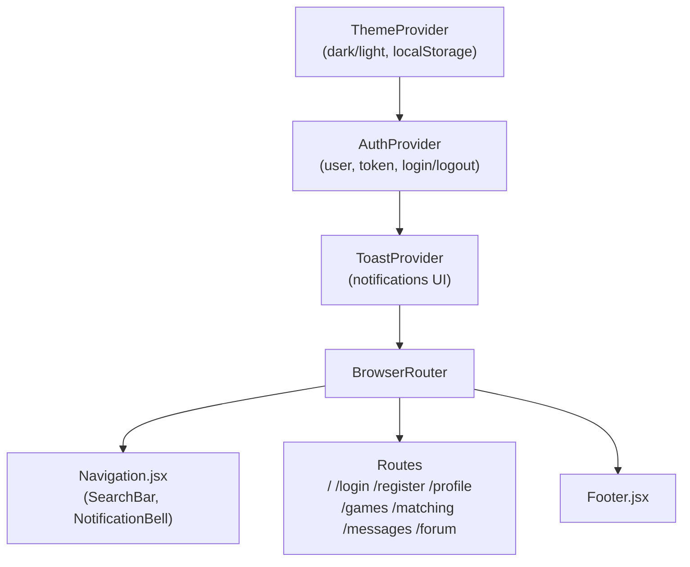
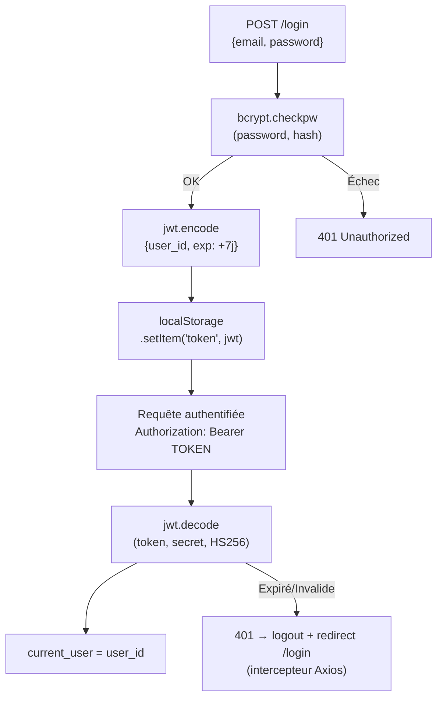
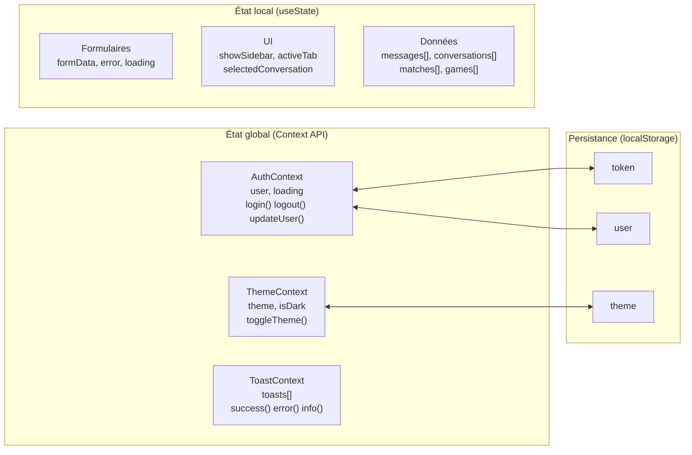

# Architecture applicative — GameConnect

## 1. Architecture générale (3-tiers)

---

## 2. Pattern architectural côté API (inspiré MVC)

---

## 3. Hiérarchie des providers React

---

## 4. Flux d'authentification JWT

---

## 5. Pattern API REST

| Ressource | GET | POST | PUT | DELETE |
|---|---|---|---|---|
| `/messages` | Liste conversations | Envoyer un message | — | — |
| `/messages/{id}` | Fil de messages | — | — | Soft-delete |
| `/user/games` | Mes jeux | Ajouter un jeu | — | — |
| `/user/games/{id}` | — | — | Modifier un jeu | Supprimer un jeu |
| `/matches` | Mes matchs | Trouver des matchs | — | — |
| `/matches/{id}/accept` | — | Accepter | — | — |
| `/notifications` | Mes notifications | — | — | Supprimer tout |
| `/notifications/{id}` | — | — | — | Supprimer |

**Codes HTTP utilisés** :
- `200 OK` — Succès général
- `201 Created` — Ressource créée (ajout de jeu)
- `400 Bad Request` — Données invalides
- `401 Unauthorized` — Token manquant ou expiré
- `403 Forbidden` — Action non autorisée (ex: message sans match)
- `404 Not Found` — Ressource introuvable
- `409 Conflict` — Doublon (email, jeu déjà ajouté)

---

## 6. Gestion de l'état frontend

