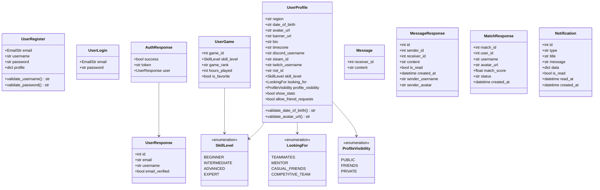
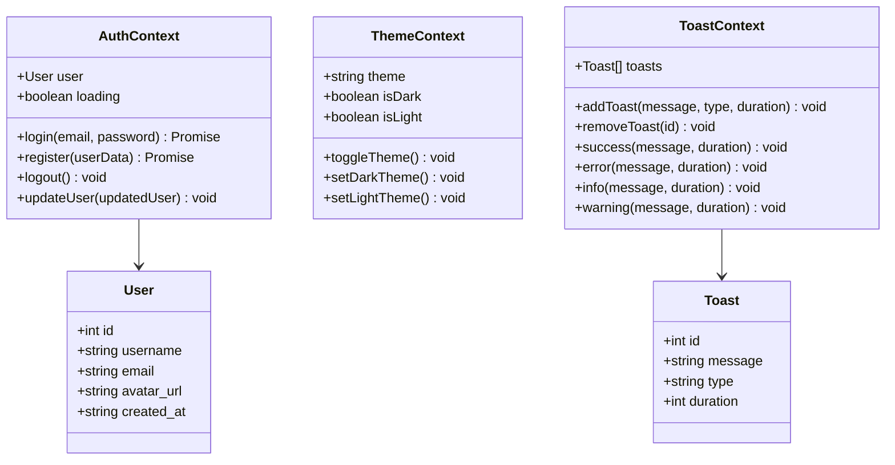

# Diagramme de classes — GameConnect

## 1. Classes Backend (Pydantic / FastAPI)

```mermaid
classDiagram
    class UserRegister {
        +EmailStr email
        +str username
        +str password
        +dict profile
        +validate_username() str
        +validate_password() str
    }

    class UserLogin {
        +EmailStr email
        +str password
    }

    class UserResponse {
        +int id
        +str email
        +str username
        +bool email_verified
    }

    class AuthResponse {
        +bool success
        +str token
        +UserResponse user
    }

    class UserProfile {
        +str region
        +str date_of_birth
        +str avatar_url
        +str banner_url
        +str bio
        +str timezone
        +str discord_username
        +str steam_id
        +str twitch_username
        +str riot_id
        +SkillLevel skill_level
        +LookingFor looking_for
        +ProfileVisibility profile_visibility
        +bool show_stats
        +bool allow_friend_requests
        +validate_date_of_birth() str
        +validate_avatar_url() str
    }

    class UserGame {
        +int game_id
        +SkillLevel skill_level
        +str game_rank
        +int hours_played
        +bool is_favorite
    }

    class Message {
        +int receiver_id
        +str content
    }

    class MessageResponse {
        +int id
        +int sender_id
        +int receiver_id
        +str content
        +bool is_read
        +datetime created_at
        +str sender_username
        +str sender_avatar
    }

    class MatchResponse {
        +int match_id
        +int user_id
        +str username
        +str avatar_url
        +float match_score
        +str status
        +datetime created_at
    }

    class Notification {
        +int id
        +str type
        +str title
        +str message
        +dict data
        +bool is_read
        +datetime read_at
        +datetime created_at
    }

    class SkillLevel {
        <<enumeration>>
        BEGINNER
        INTERMEDIATE
        ADVANCED
        EXPERT
    }

    class LookingFor {
        <<enumeration>>
        TEAMMATES
        MENTOR
        CASUAL_FRIENDS
        COMPETITIVE_TEAM
    }

    class ProfileVisibility {
        <<enumeration>>
        PUBLIC
        FRIENDS
        PRIVATE
    }

    AuthResponse --> UserResponse
    UserProfile --> SkillLevel
    UserProfile --> LookingFor
    UserProfile --> ProfileVisibility
    UserGame --> SkillLevel
```

---

## 2. Services Frontend (JavaScript)

```mermaid
classDiagram
    class ApiClient {
        +string baseURL
        +interceptors request
        +interceptors response
        +get(url) Promise
        +post(url, data) Promise
        +put(url, data) Promise
        +delete(url) Promise
    }

    class AuthAPI {
        +register(userData) Promise
        +login(credentials) Promise
    }

    class ProfileAPI {
        +getProfile() Promise
        +updateProfile(data) Promise
        +getActivityStats() Promise
    }

    class GamesAPI {
        +getAllGames() Promise
        +getUserGames() Promise
        +addUserGame(gameData) Promise
        +updateUserGame(gameId, gameData) Promise
        +removeUserGame(gameId) Promise
    }

    class MatchingAPI {
        +findMatches() Promise
        +getMatches() Promise
        +acceptMatch(matchId) Promise
        +rejectMatch(matchId) Promise
    }

    class MessagesAPI {
        +getConversations() Promise
        +getMessages(userId) Promise
        +sendMessage(receiverId, content) Promise
        +deleteMessage(messageId) Promise
    }

    class NotificationsAPI {
        +getNotifications(params) Promise
        +getUnreadCount() Promise
        +markAsRead(notificationId) Promise
        +markAllAsRead() Promise
        +deleteNotification(notificationId) Promise
        +clearNotifications(readOnly) Promise
    }

    class SearchAPI {
        +searchPlayers(params) Promise
        +searchGames(params) Promise
        +getSuggestions(query) Promise
    }

    class StatsAPI {
        +getPlatformStats() Promise
        +getPopularPlayers(limit) Promise
        +getRecentlyActive(limit) Promise
        +getTopMatchers(limit) Promise
        +getGamesRanking(limit) Promise
        +getUserStats(userId) Promise
    }

    ApiClient <|-- AuthAPI
    ApiClient <|-- ProfileAPI
    ApiClient <|-- GamesAPI
    ApiClient <|-- MatchingAPI
    ApiClient <|-- MessagesAPI
    ApiClient <|-- NotificationsAPI
    ApiClient <|-- SearchAPI
    ApiClient <|-- StatsAPI
```

---

## 3. Contextes React (State Management)

```mermaid
classDiagram
    class AuthContext {
        +User user
        +boolean loading
        +login(email, password) Promise
        +register(userData) Promise
        +logout() void
        +updateUser(updatedUser) void
    }

    class ThemeContext {
        +string theme
        +boolean isDark
        +boolean isLight
        +toggleTheme() void
        +setDarkTheme() void
        +setLightTheme() void
    }

    class ToastContext {
        +Toast[] toasts
        +addToast(message, type, duration) void
        +removeToast(id) void
        +success(message, duration) void
        +error(message, duration) void
        +info(message, duration) void
        +warning(message, duration) void
    }

    class User {
        +int id
        +string username
        +string email
        +string avatar_url
        +string created_at
    }

    class Toast {
        +int id
        +string message
        +string type
        +int duration
    }

    AuthContext --> User
    ToastContext --> Toast
```
