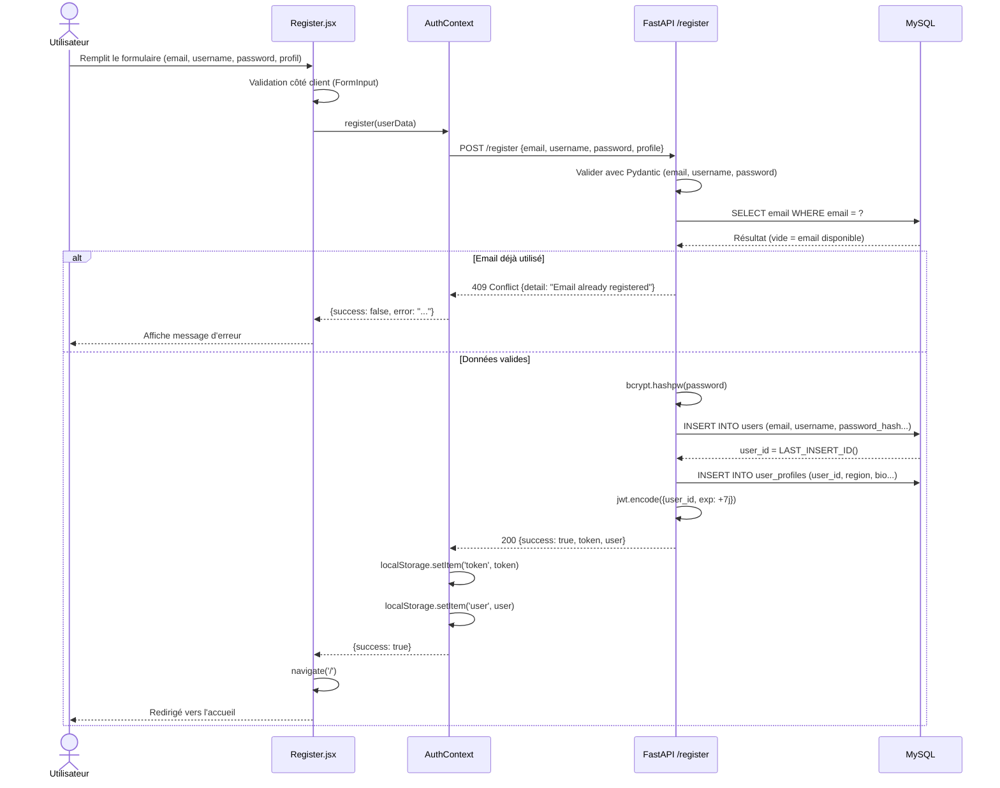
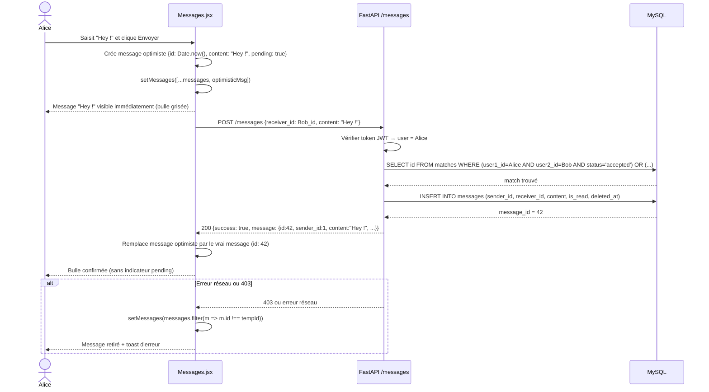
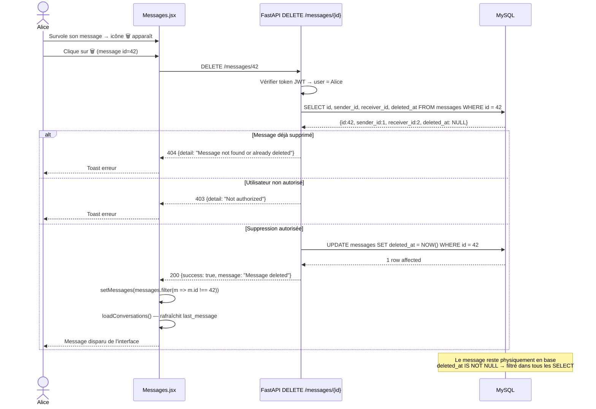
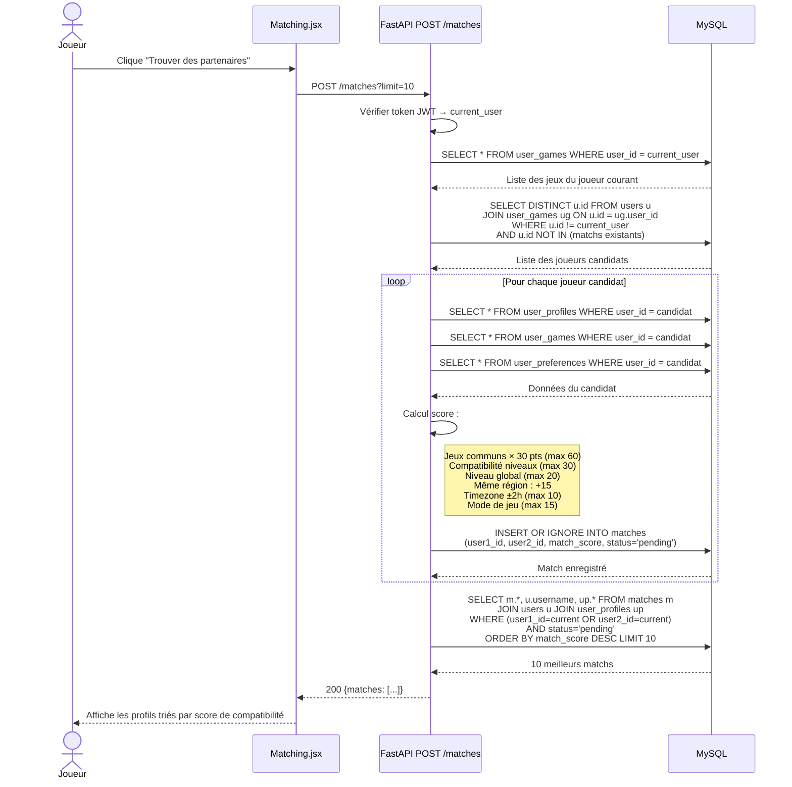

# Diagrammes de séquence — GameConnect

## Séquence 1 : Inscription d'un nouvel utilisateur

---

## Séquence 2 : Envoi d'un message (avec mise à jour optimiste)

---

## Séquence 3 : Suppression logique d'un message (soft-delete)

---

## Séquence 4 : Algorithme de matching

