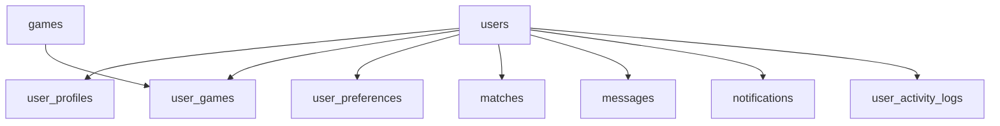

# Base de données — GameConnect

## 1. Structure du dossier `localsetup/`

```
localsetup/
├── README.md
├── schema/
│   ├── 00_schema_complet.sql   → Schéma complet (DROP + CREATE de toutes les tables + index)
│   └── 01_donnees_jeux.sql     → 20 jeux du catalogue
├── seeds/
│   └── 02_utilisateurs_test.sql → 4 utilisateurs + 1 match (pour démonstration)
└── migrations/                  → Historique des évolutions (pour mise à jour)
    ├── 001_add_indexes_and_banner.sql
    ├── 002_notifications_table.sql
    └── 003_soft_delete_messages.sql
```

---

## 2. Schéma complet — 9 tables

Le fichier `00_schema_complet.sql` crée les tables suivantes dans l'ordre (respect des FK) :



| # | Table | Lignes clés | Particularité |
|---|---|---|---|
| 1 | `users` | 11 colonnes | Authentification centrale |
| 2 | `user_profiles` | 20 colonnes | UNIQUE(user_id) → relation 1-1 |
| 3 | `games` | 5 colonnes | Catalogue de référence |
| 4 | `user_games` | 8 colonnes | UNIQUE(user_id, game_id) → relation N-N |
| 5 | `user_preferences` | 4 colonnes | Préférences gaming |
| 6 | `matches` | 6 colonnes | UNIQUE(user1_id, user2_id) |
| 7 | `messages` | 7 colonnes | `deleted_at` pour soft-delete |
| 8 | `notifications` | 10 colonnes | Champ `data` JSON |
| 9 | `user_activity_logs` | 6 colonnes | Audit trail |

---

## 3. Soft-delete des messages (migration 003)

La table `messages` implémente le pattern **soft-delete** :

```sql
-- Colonne ajoutée dans la version 2.0
deleted_at TIMESTAMP NULL DEFAULT NULL
```

| Valeur de `deleted_at` | Signification |
|---|---|
| `NULL` | Message actif, visible dans l'interface |
| `2026-04-10 15:30:00` | Message supprimé, filtré dans tous les SELECT |

**Requêtes affectées** :
```sql
-- GET /messages (liste conversations)
SELECT ... FROM messages m
WHERE (m.sender_id = ? OR m.receiver_id = ?)
AND m.deleted_at IS NULL   -- ← filtre ajouté

-- Sous-requête last_message
(SELECT content FROM messages
 WHERE (sender_id = u.id OR receiver_id = u.id)
 AND deleted_at IS NULL   -- ← filtre ajouté
 ORDER BY created_at DESC LIMIT 1)

-- GET /messages/{other_user_id}
WHERE (m.sender_id = ? AND m.receiver_id = ?)
   OR (m.sender_id = ? AND m.receiver_id = ?)
AND m.deleted_at IS NULL   -- ← filtre ajouté

-- DELETE /messages/{id} → soft-delete
UPDATE messages SET deleted_at = NOW() WHERE id = ?
```

---

## 4. Algorithme de matching

Le score de compatibilité est calculé dans `API/app/routes/matches.py` :

```python
score = 0

# Jeux en commun (30 pts chacun, max 60)
common_games = set(user_games) & set(candidate_games)
score += min(len(common_games) * 30, 60)

# Compatibilité des niveaux sur les jeux communs (max 30)
skill_diff = abs(skill_map[user_level] - skill_map[candidate_level])
score += max(0, 30 - skill_diff * 10)

# Niveau global similaire (max 20)
global_diff = abs(global_skill_map[user] - global_skill_map[candidate])
score += max(0, 20 - global_diff * 7)

# Même région (15 pts)
if user_region == candidate_region:
    score += 15

# Même timezone ±2h (max 10)
tz_diff = abs(parse_tz(user_tz) - parse_tz(candidate_tz))
if tz_diff <= 2:
    score += max(0, 10 - tz_diff * 3)

# Mode de jeu compatible (max 15)
if user_mode == candidate_mode or 'any' in (user_mode, candidate_mode):
    score += 15
```

---

## 5. Scripts de vérification

```sql
-- 1. Vérifier les tables créées
USE esport_social;
SHOW TABLES;

-- 2. Vérifier la structure de messages (soft-delete)
DESCRIBE messages;
-- → La colonne deleted_at doit apparaître

-- 3. Compter les jeux du catalogue
SELECT COUNT(*) AS nb_jeux FROM games;
-- → 20

-- 4. Vérifier les utilisateurs de test
SELECT username, email, account_status
FROM users
WHERE email LIKE '%@test.com';

-- 5. Vérifier le match Alice-Bob
SELECT m.id, u1.username AS user1, u2.username AS user2, m.status
FROM matches m
JOIN users u1 ON m.user1_id = u1.id
JOIN users u2 ON m.user2_id = u2.id;
-- → AliceShooter - BobTheGamer : accepted

-- 6. Tester le soft-delete manuellement
UPDATE messages SET deleted_at = NOW() WHERE id = 1;
SELECT id, content, deleted_at FROM messages WHERE id = 1;
-- → deleted_at non NULL : message logiquement supprimé

-- 7. Vérifier que le message supprimé ne s'affiche plus
SELECT * FROM messages WHERE deleted_at IS NULL;
```
